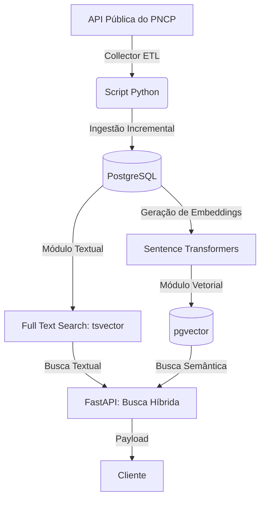

<h1 align="center">Sistema Inteligente de Análise de Licitações</h1>

  Python | FastAPI | PostgreSQL | Docker

  <strong>Pipeline ETL e busca semântica para automação de licitações públicas com Inteligência Artificial.</strong>

> 🔒 **Nota de Portfólio:** Código privado devido a diretrizes de propriedade intelectual e viabilidade comercial. Este repositório documenta a arquitetura, decisões de engenharia e os desafios técnicos no desenvolvimento para fins de portfólio.

---

## 📝 Contexto

O Portal Nacional de Contratações Públicas (PNCP) centraliza dados de licitações públicas brasileiras, porém apresenta desafios importantes para a descoberta eficiente de oportunidades relevantes pelas empresas:

* 📦 Grande volume de registros
* 🎯 Baixa relevância em buscas textuais tradicionais
* 🌐 Múltiplos sistemas externos e endpoints de contratação
* ⚠️ Inconsistências operacionais e timeout na API pública
* 🤝 Dificuldade de matching entre empresas e licitações

Este projeto explora a construção de uma pipeline de ingestão e uma camada de busca híbrida inteligente para resolver esses problemas de mercado.

---

## 🏗️ Arquitetura do Sistema

---

## 🛠️ Stack

- **Python**
- **FastAPI**
- **PostgreSQL**
- **SQLAlchemy**
- **pgvector** — busca vetorial
- **Sentence Transformers** — embeddings semânticos
- **Docker**

---

## ⚙️ Funcionalidades Atuais

- Coleta incremental de licitações do PNCP
- Busca textual com PostgreSQL Full Text Search (`tsvector`)
- Busca semântica com embeddings vetoriais
- API REST para consulta, paginação e filtros
- Ordenação por similaridade semântica

---

## 🛡️ Desafios Técnicos

**1. Instabilidade da API do PNCP**
* **Problema:** Lentidão, timeouts e falhas em requisições consecutivas.
* **Solução:** Implementação de timeouts, retries controlados, delays entre chamadas e coleta incremental.

**2. Busca textual limitada**
* **Problema:** A busca por palavras-chave tem baixa precisão semântica. *Exemplo:* Buscas por `"alimentação"` retornando registros relacionados a transporte ou logística.
* **Solução:** Abordagem híbrida combinando PostgreSQL Full Text Search (`tsvector`) para termos exatos + busca vetorial com `pgvector` para contexto.

---

## 📸 Screenshots

### 🧠 Busca Semântica

#### Requisição

#### Resposta

