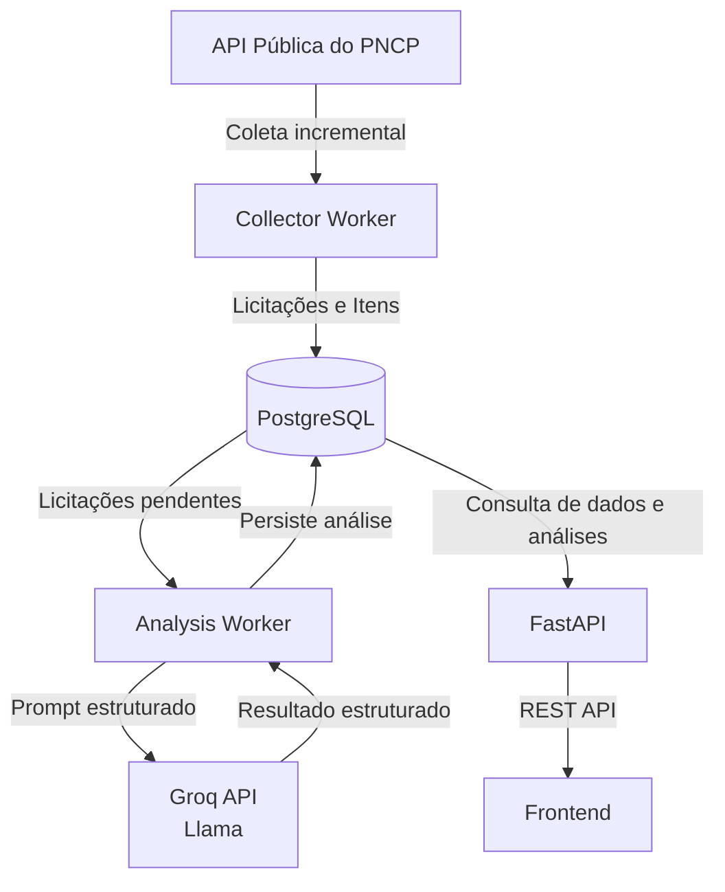

<h1 align="center">Sistema Inteligente para Descoberta de Oportunidades em Licitações Públicas</h1>

  Python | FastAPI | Groq | PostgreSQL | Docker

  <strong>Plataforma para coleta, enriquecimento semântico e matching entre empresas e licitações públicas.</strong>

> 🔒 **Nota de Portfólio:** Código privado devido a diretrizes de propriedade intelectual e viabilidade comercial. Este repositório documenta a arquitetura, decisões de engenharia e os desafios técnicos no desenvolvimento para fins de portfólio.

---

## 📝 Contexto

O Portal Nacional de Contratações Públicas (PNCP) centraliza dados de licitações públicas brasileiras, porém identificar oportunidades realmente relevantes ainda é um processo trabalhoso para muitas empresas.

Entre os principais desafios estão:

* 📦 Grande volume de licitações publicadas diariamente
* 🔍 Descrições heterogêneas e pouco padronizadas
* 🌐 Dados distribuídos em múltiplos endpoints
* ⚠️ Instabilidade operacional da API pública (timeouts e indisponibilidades)
* 🤝 Dificuldade em conectar o perfil comercial das empresas às oportunidades disponíveis

Este projeto consiste no desenvolvimento de uma plataforma para descoberta de oportunidades em licitações públicas, composta por um pipeline de coleta de dados, enriquecimento semântico com LLM, API REST e mecanismos de matching entre empresas e licitações.

---

## 🏗️ Arquitetura atual do Sistema

---

## 🛠️ Stack

- **Python**
- **FastAPI**
- **SQLAlchemy**
- **PostgreSQL**
- **Groq**
- **Llama 3.3**
- **Docker**

---

## ⚙️ Funcionalidades Atuais

- Coleta incremental de licitações do PNCP
- Enriquecimento de dados utilizando LLM
- Geração automática de:
  - descrição normalizada
  - palavras-chave
  - setores relacionados
- API REST para consulta e filtros
- Mecanismo de matching entre empresas e licitações

---

## 🛡️ Desafios Técnicos

**1. Instabilidade da API do PNCP**
* **Problema:** Lentidão, timeouts e falhas em requisições consecutivas.
* **Solução:** Implementação de timeouts, retries controlados, delays entre chamadas e coleta incremental.

**2. Dados heterogêneos e pouco estruturados**
* **Problema:** As descrições das licitações variam significativamente em qualidade e nível de detalhe, podendo conter desde poucas palavras até longos textos administrativos, dificultando a identificação do objeto comercial da contratação.
* **Solução:** Utilização de LLM para normalizar as descrições, extrair palavras-chave relevantes e identificar os setores relacionados à contratação.

**3. Licitações multidisciplinares**
* **Problema:** Uma mesma licitação pode reunir produtos e serviços de diferentes áreas de atuação, tornando inadequada uma classificação única.
* **Solução:** Modelagem baseada em múltiplos setores relacionados, permitindo representar licitações que abrangem diferentes segmentos e melhorar estratégias de matching.

**4. Limitações dos modelos de linguagem**
* **Problema:** Modelos menores apresentaram baixa capacidade para interpretar corretamente descrições heterogêneas e identificar o contexto comercial das licitações.
* **Solução:** Comparação entre modelos executados localmente e modelos hospedados, resultando na adoção da API da Groq como estratégia para equilibrar qualidade das análises, latência operacional, custos e simplicidade da infraestrutura.
